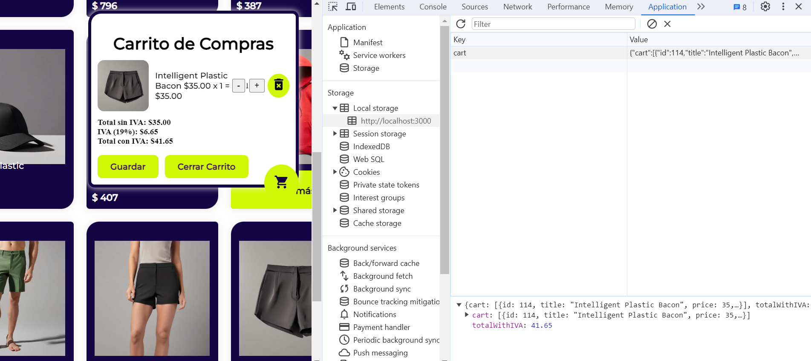
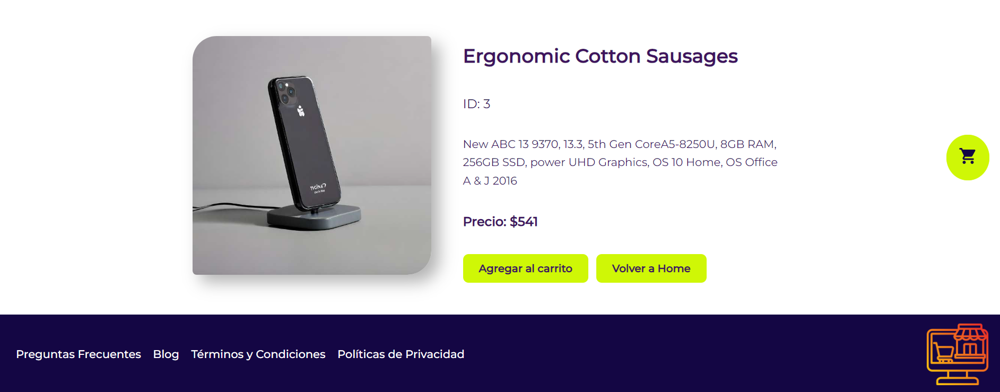
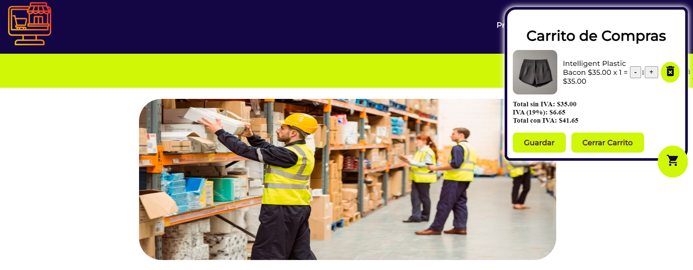
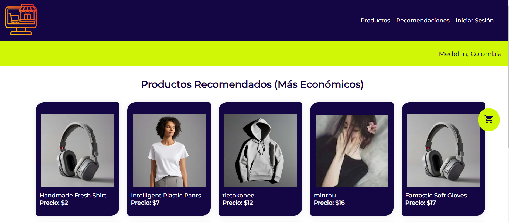

# PruebaFrontend - MarketplaceJV de Compras

## Descripción

Esta es una aplicación web de compras que te permite explorar y comprar productos en línea. La aplicación utiliza React para construir la interfaz de usuario y gestionar el carrito de compras.

## Capturas de Pantalla
## Almacenamiento Local Storage

## Características

- Visualización de productos.
- Páginas de detalles de productos.
- Agregar productos al carrito.
- Modificación de la cantidad de productos en el carrito.
- Eliminación de productos del carrito.
- Cálculo de totales con y sin IVA.
- Guardar el carrito en el almacenamiento local del navegador.
- Visualización de productos recomendados.
- Mensajes emergentes de confirmación al agregar productos al carrito.

## Componentes

### `App`

- **Propósito:** El componente raíz de la aplicación que configura la navegación y proporciona el contexto global del carrito de compras.
- **Tecnologías utilizadas:** React, React Router.

### `Header`

- **Propósito:** La barra de navegación superior que muestra el título de la aplicación y un ícono de carrito de compras.
- **Tecnologías utilizadas:** HTML, CSS.

### `Home`

- **Propósito:** La página principal de la aplicación que muestra una lista de productos disponibles para comprar.
- **Tecnologías utilizadas:** React, API para obtener datos de productos.

### `ProductDetails`

- **Propósito:** La página de detalles de un producto que muestra información detallada y permite agregar el producto al carrito.
- **Tecnologías utilizadas:** React, Axios para realizar solicitudes a la API, React Router para la navegación.

### `ProductCart`

- **Propósito:** El carrito de compras que muestra los productos agregados y permite realizar acciones como agregar, eliminar o modificar la cantidad de productos.
- **Tecnologías utilizadas:** React, Context API para administrar el estado global del carrito.

### `Recomendations`

- **Propósito:** Muestra una lista de los 10 productos más económicos recomendados para el usuario.
- **Tecnologías utilizadas:** React, Axios para obtener datos de productos.

## Por qué se utilizó cada tecnología

- **React:** Se utilizó para construir la interfaz de usuario de la aplicación de manera eficiente y modular.
- **React Router:** Se utilizó para gestionar la navegación y permitir a los usuarios acceder a diferentes páginas de la aplicación.
- **Context API:** Se utilizó para gestionar el estado global del carrito de compras y permitir que múltiples componentes accedan y actualicen ese estado de manera sencilla.
- **Axios:** Se utilizó para realizar solicitudes HTTP y obtener datos de la API externa.

## Instalación

1. Clona este repositorio.
2. Navega al directorio del proyecto.
3. Ejecuta `npm install` para instalar las dependencias.
4. Ejecuta `npm start` para iniciar la aplicación en modo de desarrollo.

¡Disfruta comprando en nuestra aplicación!
